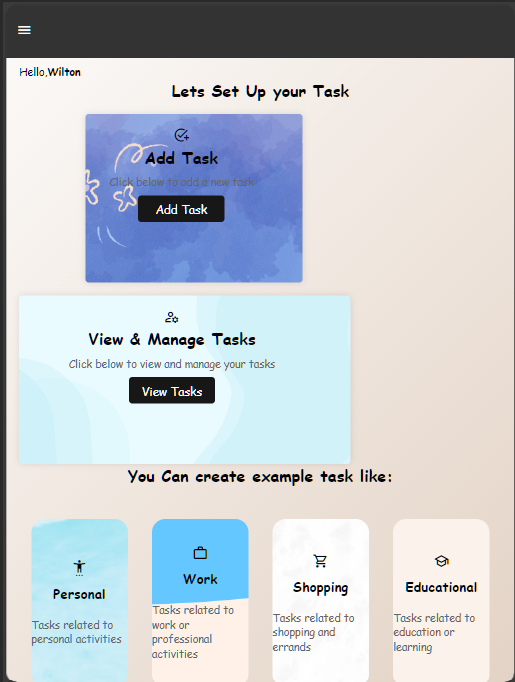

# Task Management App

This repository contains the code for a task management app designed to help users organize their tasks efficiently.

## Features

- Add and remove tasks
- Mark tasks as complete
- User-friendly interface
- Responsive design for mobile and desktop

## Technologies Used

- HTML
- CSS
- JavaScript

## Installation

1. Clone the repository
2. Open `index.html` in your web browser

## Usage

- Add new tasks by entering the task details and clicking "Add Task"
- Mark tasks as complete by clicking the checkbox
- Remove tasks by clicking the delete button
## Screenshot

## Credits

This app was created by Tatoh Modest

## License

This project is licensed under the MIT License - see the [LICENSE.md](LICENSE.md) file for details.
